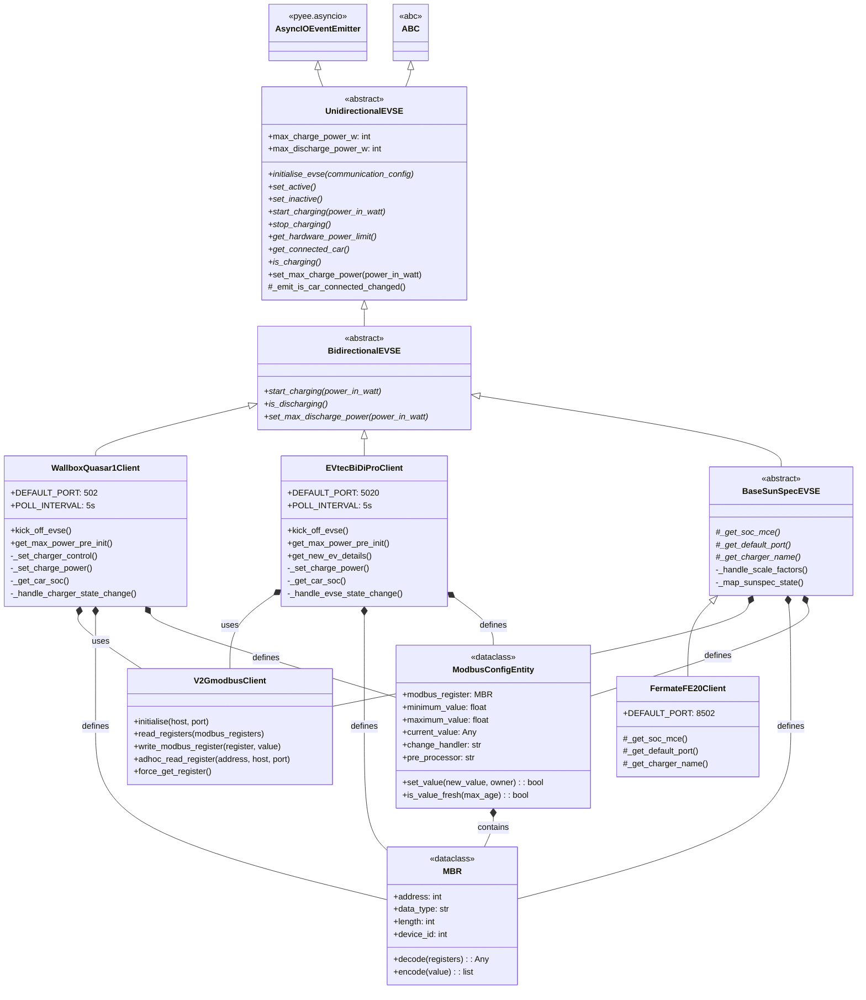

# Charger Class Structure

This diagram shows the inheritance hierarchy and relationships between charger classes in V2G Liberty.

## Summary

| Class | Type | Lines | Purpose |
|-------|------|-------|---------|
| `UnidirectionalEVSE` | Abstract | 156 | Base for charge-only chargers |
| `BidirectionalEVSE` | Abstract | 33 | Base for V2G chargers |
| `BaseSunSpecEVSE` | Abstract | 914 | Base for SunSpec-compliant chargers |
| `WallboxQuasar1Client` | Concrete | 1401 | Wallbox Quasar 1 DC charger |
| `EVtecBiDiProClient` | Concrete | 1129 | EVtec BiDiPro 10 charger |
| `FermateFE20Client` | Concrete | 74 | Fermate FE20 (SunSpec-based) |
| `V2GmodbusClient` | Support | 607 | Modbus TCP communication layer |
| `MBR` | Dataclass | - | Modbus register definition |
| `ModbusConfigEntity` | Dataclass | - | Charger entity with validation |

## Adding a New Charger

1. **SunSpec-compliant charger**: Inherit from `BaseSunSpecEVSE` (simplest - see `FermateFE20Client`)
2. **Custom protocol**: Inherit from `BidirectionalEVSE` or `UnidirectionalEVSE`

---
*Generated: 2026-01-20*
